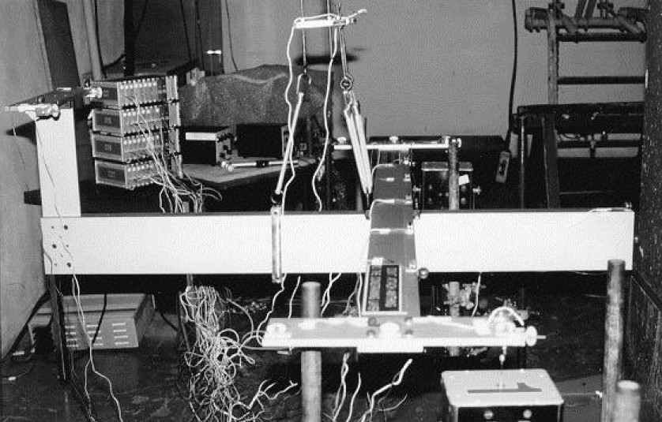
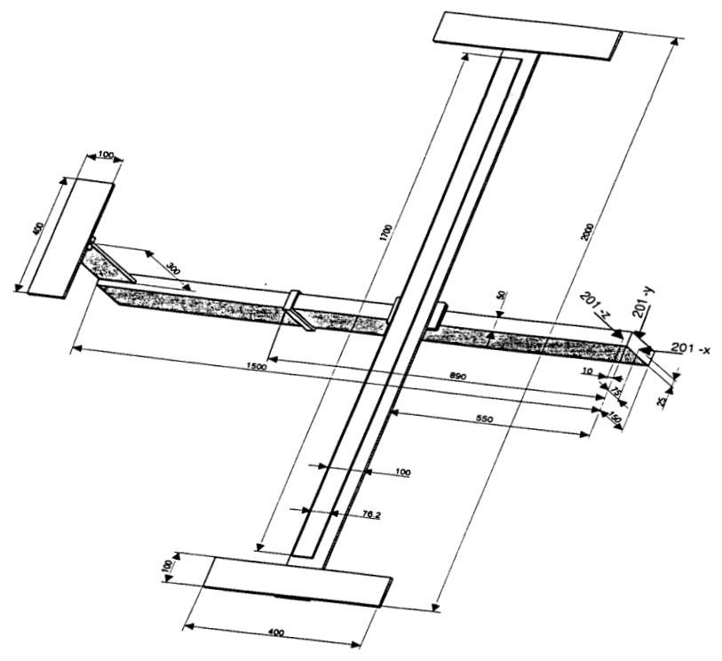

# GARTEUR SM-AG19 Testbed: Construction of the geometry

Source code: [`garteur_geometry_tut.jl`](garteur_geometry_tut.jl)

Last updated: 04/19/24

## Description

This virtual test application is based on the test article
used by the GARTEUR Structures & Materials Action Group 19
which organized a Round Robin exercise where 12 European laboratories
tested a single structure between 1995 and 1997. The benchmark structure
was a laboratory structure built to simulate the dynamic behaviour
of an aeroplane. The structure was initially built for a benchmark
study on experimental modal analysis conducted by the
Structures and Materials Action Group (SM-AG19) of the Group
for Aeronautical Research and Technology in EURope (GARTEUR).
The test-bed was designed and manufactured by ONERA, France.



### References

- [GARTEUR] Ground Vibration Test Techniques, compiled by A Gravelle, GARTEUR
  Structures & Materials Action Group 19 Technical report TP-115, 1999.
- [BW] Etienne Balmes, Jan R. Wright, GARTEUR GROUP ON GROUND VIBRATION
  TESTING | RESULTS FROM THE TEST OF A SINGLE STRUCTURE BY 12 LABORATORIES IN
  EUROPE, Proceedings of DETC'97, 1997 ASME Design Engineering Technical
  Conferences, September 14-17, 1997, Sacramento, California.

## Goals

- Show how to construct model from multiple connected beams.
- Demonstrate the use of massless connectors.
- Visualize the structure interactively.

## Geometry of the testbed airplane.

The aluminum testbed was a rather simple structure which was reasonably
dynamically representative of a simple airplane structure [GARTEUR](@ref
References). It was composed of several beams simulating a fuselage with wings
and a tail. Wing tip drums allowed to adjust bending and torsion frequencies
similarly to airplane ones, with some very close modal frequencies.



The structural-element finite element code relies on the basic functionality
implemented in this general FEM package.

````julia
using FinEtools
````

This is the characteristic length. The dimensions of the aircraft frame are
expressed in terms of multiples of this characteristic unit.

````julia
L = 0.1*phun("m");
````

## Cross-section

Cross-sectional properties are incorporated in the cross-section property.
There are several rectangular cross-sections in the model: the fuselage, the
wing, the tail. There are also three massless connectors: connections between
the fuselage and the wing, between the wing structure and the viscoelastic
damping layer, and between the fuselage and the tail.

````julia
using FinEtoolsFlexStructures.CrossSectionModule: CrossSectionRectangle
````

Body of the frame (fuselage).

````julia
cs_body = CrossSectionRectangle(s -> 1.5*L, s -> L/2, s -> [1.0, 0.0, 1.0]; label = 1)
````

Wing beam.

````julia
cs_wing = CrossSectionRectangle(s -> L/10, s -> L, s -> [0.0, 0.0, 1.0]; label = 2)
````

Wing drums.

````julia
cs_drum = CrossSectionRectangle(s -> L/10, s -> L, s -> [0.0, 0.0, 1.0]; label = 3)
````

Vertical part of the tail.

````julia
cs_tailv = CrossSectionRectangle(s -> L, s -> L/10, s -> [1.0, 0.0, 1.0]; label = 4)
````

Horizontal part of the tail.

````julia
cs_tailh = CrossSectionRectangle(s -> L/10, s -> L, s -> [0.0, 0.0, 1.0]; label = 5)
````

Constraining plate on top of the viscoelastic tape.

````julia
cs_constrp = CrossSectionRectangle(s -> L*(1.1/100), s -> L*(76.2/100), s -> [0.0, 0.0, 1.0]; label = 6)
````

Massless connectors of the structural parts of the wing: the main beam and the
constraining plate.

````julia
cs_connw2c = CrossSectionRectangle(s -> L/2, s -> L/2, s -> [1.0, 0.0, 1.0]; label = 7)
````

Massless connectors of the wing and the drums.

````julia
cs_connw2d = CrossSectionRectangle(s -> L/2, s -> L/2, s -> [1.0, 0.0, 1.0]; label = 8)
````

Massless connector between the body and the wings.

````julia
cs_connb2w = CrossSectionRectangle(s -> L/5, s -> L, s -> [0.0, 1.0, 0.0]; label = 9)
````

Massless connector between the body and the tail.

````julia
cs_conntb2t = CrossSectionRectangle(s -> L, s -> L/3, s -> [1.0, 0.0, 1.0]; label = 10)
````

Massless connector between the structure and the sensors and point masses.

````julia
cs_connta2p = CrossSectionRectangle(s -> L/5, s -> L/5, s -> [1.0, 0.0, 1.0]; label = 11)
````

## Mesh

We shall use the `frame_member` utility function to generate the mesh of the individual
parts. This will result in a number of separate meshes for the members. These^
separate meshes will then be glued together (merged) based on the tolerance on
the location of the nodes.

````julia
using FinEtoolsFlexStructures.MeshFrameMemberModule: frame_member
tolerance = L/10000;
````

Number of intervals from 0.25*L to 8.5*L (the extent of the constraining plate).

````julia
nc = 8
````

We start with an empty array, and for each part that we mesh, we append the
mesh to the array. All the meshes in the array will then be considered for
merging based on geometrical tolerances.

````julia
meshes = Tuple{FENodeSet, AbstractFESet}[]
````

Define the constituent parts of the body of the aircraft.

````julia
push!(meshes, frame_member([-9*L 0 0; -8.5*L 0 0], 1, cs_body; label = cs_body.label))
push!(meshes, frame_member([-8.5*L 0 0; -8.0*L 0 0], 1, cs_body; label = cs_body.label))
push!(meshes, frame_member([-8.0*L 0 0; -2.0*L 0 0], 2, cs_body; label = cs_body.label))
push!(meshes, frame_member([-2.0*L 0 0; 0 0 0], 1, cs_body; label = cs_body.label))
push!(meshes, frame_member([0 0 0; 6*L 0 0], 2, cs_body; label = cs_body.label))
````

Define the aluminum parts of the wings.

````julia
push!(meshes, frame_member([0 0 0.805*L;  0 0.25*L 0.805*L], 1, cs_wing; label = cs_wing.label))
push!(meshes, frame_member([0 0 0.805*L;  0 -0.25*L 0.805*L], 1, cs_wing; label = cs_wing.label))
push!(meshes, frame_member([0 0.25*L 0.805*L;  0 8.5*L 0.805*L], nc, cs_wing; label = cs_wing.label))
push!(meshes, frame_member([0 -0.25*L 0.805*L;  0 -8.5*L 0.805*L], nc, cs_wing; label = cs_wing.label))
push!(meshes, frame_member([0 8.5*L 0.805*L;  0 9.5*L 0.805*L], 1, cs_wing; label = cs_wing.label))
push!(meshes, frame_member([0 -8.5*L 0.805*L;  0 -9.5*L 0.805*L], 1, cs_wing; label = cs_wing.label))
push!(meshes, frame_member([0 9.5*L 0.805*L;  0 10.0*L 0.805*L], 1, cs_wing; label = cs_wing.label))
push!(meshes, frame_member([0 -9.5*L 0.805*L;  0 -10.0*L 0.805*L], 1, cs_wing; label = cs_wing.label))
````

Define the drums at the ends of the wings.

````julia
push!(meshes, frame_member([0 +9.5*L +0.91*L; +2*L +9.5*L +0.91*L], 1, cs_drum; label = cs_drum.label))
push!(meshes, frame_member([0 +9.5*L +0.91*L; -2*L +9.5*L +0.91*L], 1, cs_drum; label = cs_drum.label))
push!(meshes, frame_member([0 -9.5*L +0.91*L; +2*L -9.5*L +0.91*L], 1, cs_drum; label = cs_drum.label))
push!(meshes, frame_member([0 -9.5*L +0.91*L; -2*L -9.5*L +0.91*L], 1, cs_drum; label = cs_drum.label))
````

Define the horizontal and vertical parts of the tail.

````julia
push!(meshes, frame_member([-8*L 0 .75*L; -8*L 0 3.35*L], 2, cs_tailv; label = cs_tailv.label))
push!(meshes, frame_member([-8*L 0 3.35*L; -8*L 0 3.75*L], 2, cs_tailv; label = cs_tailv.label))
push!(meshes, frame_member([-8*L 0 3.8*L; -8*L 2*L 3.8*L], 2, cs_tailh; label = cs_tailh.label))
push!(meshes, frame_member([-8*L 0 3.8*L; -8*L -2*L 3.8*L], 2, cs_tailh; label = cs_tailh.label))
````

Define the parts of the aluminum constraining plate for the viscoelastic layer.

````julia
push!(meshes, frame_member([-.119*L 0 0.8665*L;  -.119*L 0.25*L 0.8665*L], 1, cs_constrp; label = cs_constrp.label))
push!(meshes, frame_member([-.119*L 0 0.8665*L;  -.119*L -0.25*L 0.8665*L], 1, cs_constrp; label = cs_constrp.label))
push!(meshes, frame_member([-.119*L 0.25*L 0.8665*L;  -.119*L 8.5*L 0.8665*L], nc, cs_constrp; label = cs_constrp.label))
push!(meshes, frame_member([-.119*L -0.25*L 0.8665*L;  -.119*L -8.5*L 0.8665*L], nc, cs_constrp; label = cs_constrp.label))
````

Define the massless connectors between:
Wing - Wingdrum

````julia
push!(meshes, frame_member([0 +9.5*L +0.805*L;0 +9.5*L +0.91*L], 1, cs_connw2d; label = cs_connw2d.label))
push!(meshes, frame_member([0 -9.5*L +0.805*L;0 -9.5*L +0.91*L], 1, cs_connw2d; label = cs_connw2d.label))
````

Body-Wing

````julia
push!(meshes, frame_member([0 0 0; 0 0.25*L .805*L], 1, cs_connb2w; label = cs_connb2w.label))
push!(meshes, frame_member([0 0 0; 0 -0.25*L .805*L], 1, cs_connb2w; label = cs_connb2w.label))
````

Body-Tail

````julia
push!(meshes, frame_member([-8*L 0 0; -8*L 0 .75*L], 1, cs_conntb2t; label = cs_conntb2t.label))
````

Tail-Taildrum

````julia
push!(meshes, frame_member([-8*L 0 3.75*L; -8*L 0 3.8*L], 1, cs_connw2d; label = cs_connw2d.label))
````

Wing-Constraining plate for the viscoelastic layer
Middle connector created individually

````julia
push!(meshes, frame_member([0 0 .805*L; -.119*L 0 0.8665*L], 1, cs_connw2c; label = cs_connw2c.label))
````

Connectors alongside both wings

````julia
for i in 1:nc+1
    push!(meshes, frame_member([0 (0.25+(i-1)*8.25/nc)*L .805*L;  -.119*L (0.25+(i-1)*8.25/nc)*L 0.8665*L], 1, cs_connw2c; label = cs_connw2c.label))
    push!(meshes, frame_member([0 -(0.25+(i-1)*8.25/nc)*L .805*L;  -.119*L -(0.25+(i-1)*8.25/nc)*L 0.8665*L], 1, cs_connw2c; label = cs_connw2c.label))
end
````

Massless Sensor Connectors
Tail Sensors

````julia
push!(meshes, frame_member([-8*L 2*L 3.8*L; -(153/20)*L (37/20)*L 3.85*L], 1, cs_connta2p; label = cs_connta2p.label))# 303
push!(meshes, frame_member([-8*L -2*L 3.8*L; -(153/20)*L -(37/20)*L 3.85*L], 1, cs_connta2p; label = cs_connta2p.label))# 301
````

Wingdrum Sensors

````julia
push!(meshes, frame_member([0 9.5*L .91*L ; 0 9.8*L .96*L], 1, cs_connta2p; label = cs_connta2p.label))# 101
push!(meshes, frame_member([-2*L 9.5*L .91*L ; -1.8*L 9.8*L .96*L], 1, cs_connta2p; label = cs_connta2p.label))# 112
push!(meshes, frame_member([2*L 9.5*L .91*L ; 1.8*L 9.8*L .96*L], 1, cs_connta2p; label = cs_connta2p.label))# 111

push!(meshes, frame_member([0 -9.5*L .91*L ; 0 -9.8*L .96*L], 1, cs_connta2p; label = cs_connta2p.label))# 1
push!(meshes, frame_member([-2*L -9.5*L .91*L ; -1.8*L -9.8*L .96*L], 1, cs_connta2p; label = cs_connta2p.label))# 12
push!(meshes, frame_member([2*L -9.5*L .91*L ; 1.8*L -9.8*L .96*L], 1, cs_connta2p; label = cs_connta2p.label))# 11
````

Wingdrum complementary masses

````julia
push!(meshes, frame_member([2*L 9.5*L .91*L ; 1.8*L 9.2*L .96*L], 1, cs_connta2p; label = cs_connta2p.label))# added mass
push!(meshes, frame_member([2*L -9.5*L .91*L ; 1.8*L -9.2*L .96*L], 1, cs_connta2p; label = cs_connta2p.label))# added mass
````

## Merge all the individual members into one coherent structure

Merge all the meshes of individual parts. This will glue together nodes which
are in the "same" location. The parts of the mesh can be distinguished based
on the label.

````julia
fens, fesa = mergenmeshes(meshes, tolerance)
````

The result is the set of the finite element nodes, and an array of the finite element sets.
The sets of the finite elements can be distinguished based on the label.

The number of nodes in the mesh:

````julia
@show count(fens)
````

The number of the finite element sets:

````julia
@show length(fesa)
````

The labels of the finite element sets

````julia
@show [s.label[1] for s in fesa]'
````

End of the tutorial

````julia
nothing
````

---

*This page was generated using [Literate.jl](https://github.com/fredrikekre/Literate.jl).*

